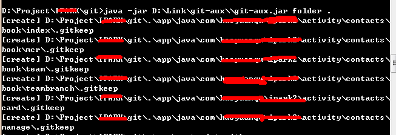

# git learn

## git概念

### git文件介绍

* .git/hooks： 钩子文件夹
* .git/info/exclude: 项目中排除的文件
* .git/logs/：日志文件夹，该文件夹可以通过.git/objects来重构。
* .git/objects： object文件夹
* .git/refs： 引用文件存放，比如说head,remote,notes...
* .git/config： git项目配置文件。
* .git/HEAD： 当前分支信息
* .git/index： 暂存区文件
* .gitignore： **对项目中需要忽略的文件进行配置。**
* .gitkeep： 按照默认约定，如果是**空文件夹**，则需要存放这个文件。

### git object 和 ref

#### object

在git中存在着一些object，通过object来描述版本变更的信息。

* blob object：用于存储具体某个文件的内容。
* tree object：类似Unix的目录对象，记录着指向blob object和tree object 的hash_id。`root tree object`类似于Unix系文件统中的 `/` 。
* commit object:每一次commit操作，都会生成一个commit object，它记录着`root tree object`，上一个commit object 的 hash_id，作者等信息。

注意：通过hash_id，我们就可以引用某一个具体的object了。

#### ref

在git中存在HEAD，master，branch-dev，tag-v1，commit-id 等ref概念：

* HEAD(.git/HEAD)：指向当前branch的信息，如master，或者 branch-dev。
* master(.git/refs/heads/master)：master分支，记录着master的commit-id。
* branch-dev(.git/refs/heads/branch-dev)：某个branch分支，记录着该branch的commit-id
* tag-v1(.git/refs/tags/tag-v1)：某个tags分支，表示指向一个不可写的commit-id。
* commit-id：commit-id 其实就是一个commit对象的hash_id数值。

#### 小结

通过这张图片，可以非常清晰的看到git的工作机制。通过object来存储版本库信息，通过ref来形成branch，tag等的概念，以及相应的操作。

### 工作区和版本库

* 工作区（Working Directory）：就是你在电脑里能看到的目录，比如我的learngit文件夹就是一个工作区
* 版本库（Repository）：工作区有一个隐藏目录.git，这个不算工作区，而是Git的版本库。Git的版本库里存了很多东西，其中最重要的就是称为stage（或者叫index）的暂存区，还有Git为我们自动创建的第一个分支master，以及指向master的一个指针叫HEAD。

#### 暂存区

* git的暂存区相当于最后一次提交的目录拷贝。
* diff：通过扫描工作区的文件hash和暂存区的各个文件hash数值，就可以知道文件是否发生变化了。
* add：一旦进行add操作后，暂存区就存储工作区的这个文件到objects中，并且记录相应的hash数值。
* reset：reset操作相当于还原暂存区的信息到指定commit版本(默认HEAD)，如果添加`--hard`参数，那么还会整理工作区的文件，如果reset 的版本非HEAD，那么还会修改相应的ref的commit-id。
* commit: git进行 commit操作，其实就是通过暂存区构建一个`root tree object`，然后关联到`commit object`中。

### git的分布式

#### git服务器

git天生是分布式的，如图：

git系统通常有一台充当“中央服务器”的电脑，但这个服务器的作用仅仅是用来方便“交换”大家的修改，没有它大家也一样干活，只是交换修改不方便而已。

#### git fork

在github中，我们会经常看到fork。通过fork，我们完整的clone了一份代码到我们自己的仓库空间中。我们可以进行开发，然后通过 `pull request` 来通知`官方的仓库`，从而来共享你的这个代码。

可以发现，这里涉及到两个不同的代码仓库，也证明了git是支持多仓库管理的。

## 常用命令

### 创建

复制一个已经创建的仓库

`git clone https://git.oschina.net/darkgem/git.git`

创建一个新的本地仓库

`git init`

### 本地修改

显示工作路径下全部已修改的文件

`git status`

显示与暂存区文件的不同

`git diff`

显示与最近一次提交的版本不同

`git diff HEAD`

显示暂存区与最近一次提交的版本不同

`git diff --cached`

把当前所有修改添加到暂存区中

`git add .`

制定某个文件添加到暂存区中

`git add -- path`

提交本地所有修改

`git commit -a -m msg`

提交暂存区修改

`git commit -m msg`

### 提交历史

从最新提交开始显示所有的提交记录

`git log`

从最新提交开始显示所有的提交记录(图形结构)

`git log --graph`

显示指定文件的所有修改

`git log -- path`

谁，在什么时间，修改了文件什么内容

`git blame -- path`

### 分支和标签

显示所有分支

`git branch -av`

切换当前分支

`git checkout <branch_name>`

创建新分支

`git branch <new_branch_name> [<start_point>]`

注意：`<start_point>`为可选，默认为HEAD

删除本地分支

`git branch -d <branch_name>`

强制删除本地分支

`git branch -D <branch_name>`

标记tag

`git tag <tag_name>`

查看tag

`git tag`

删除tag

`git tag -d <tag_name>`

### 更新与发布

查看当前remote

`git remote -v`

添加新的remote

`git remote add <remote_name> <url>`

拉取指定远程分支

`git fetch -v [-p] <remote> [<remote-branch>][:<local-branch>]`

**-p：**After fetching, remove any remote-tracking references that no longer exist on the remote.

拉取所有远程分支

`git fetch -v [-p] --all`

**-p：**After fetching, remove any remote-tracking references that no longer exist on the remote.

推送本地到remote

`git push -v [-u] <remote> [<local-branch>][:<remote-branch>]`

注意：如果添加-u参数，则表示将当前分支和远程的remote:branch关联起来，且一个本地分支只能和一个远程分支关联。**如果local-branch为空，则表示删除该remote分支。**

推送本地所有分支到指定remote下

`git push -v --all [<remote>]`

发布标签

`git push --tags`

### 合并和重置

合并当前分支

`git merge <branch>`

退出merge

`git merge --abort`

将分支rebase到当前分支

`git rebase <branch>`

退出rebase

`git rebase --abort`

解决冲突后，继续rebase

`git rebase --continue`

标记已解决冲突文件

`git add <resolved-file>`

### 撤销

回滚提交，但是保留修改的文件

`git reset HEAD^ | <commit_id>`

注意：^表示前一次版本，如果是 ^^ 就是前两次。

回滚提交，但是不保留修改的文件

`git reset --hard HEAD^ | <commit_id>`

注意：^表示前一次版本，如果是 ^^ 就是前两次。

放弃某个文件的所有修改（暂存区对比）

`git checkout -- <file>`

放弃某个文件的所有修改（最后一次提交对比）

`git checkout HEAD -- <file>`

## .gitkeep工具

使用Java写的一个批量添加空文件.gitkeep的工具，如果存在其他文件，则删除.gitkeep

演示截图:

项目地址：[GIT-AUX](http://git.oschina.net/darkgem/git-aux)

## 参考

* [Git教程](http://www.liaoxuefeng.com/wiki/0013739516305929606dd18361248578c67b8067c8c017b000)
* [git-workflow-tutorial](https://github.com/xirong/my-git/blob/master/git-workflow-tutorial.md)
* [Git详解之一：Git起步](http://blog.jobbole.com/25775/)
* [Git详解之二：Git基础](http://blog.jobbole.com/25808/)
* [Git详解之三：Git分支](http://blog.jobbole.com/25877/)
* [Git详解之九：Git内部原理](http://blog.jobbole.com/26209/)
* [git-scm-doc](https://git-scm.com/docs)